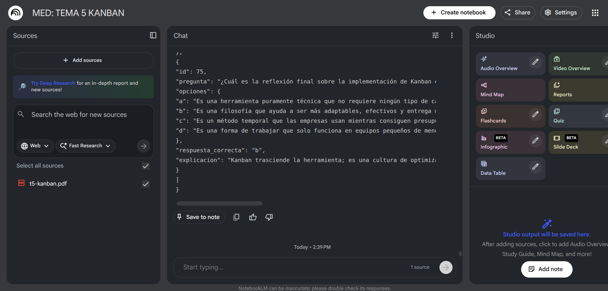

# 👑 PeruvianKING Quiz System


Un sistema de evaluación moderno, interactivo y dinámico diseñado para la gestión y ejecución de tests automatizados.

[Visita la web para usar la app](https://peruvianking.com)

## Características Principales

*   **📂 Organización por Carpetas**: Navega fácilmente entre diferentes categorías de tests desde la pantalla de inicio.
*   **⚡ Carga Dinámica**: El sistema detecta y carga automáticamente los tests situados en las subcarpetas de `src/data`.
*   **🎮 Modo Interactivo**:
    *   Feedback inmediato (Correcto/Incorrecto).
    *   Explicaciones detalladas con soporte para bloques de código.
    *   Barra de progreso en tiempo real.
*   **📝 Creador de Tests**: Herramienta integrada para importar tests personalizados mediante JSON.
*   **🔍 Búsqueda Inteligente**: Filtra tests por título, descripción o temas.
*   **📱 Diseño Responsive**: Interfaz adaptada a móviles y escritorio con estética moderna (Glassmorphism, gradientes).

---

## 🛠️ Tecnologías Usadas

*   **Frontend Framework**: [React 19](https://react.dev/)
*   **Build Tool**: [Vite](https://vitejs.dev/)
*   **Estilos**: [Tailwind CSS](https://tailwindcss.com/) 
*   **Iconos**: [Lucide React](https://lucide.dev/)

---

## 🚀 Comenzando

Sigue estos pasos para ejecutar el proyecto localmente:

### Prerrequisitos
*   Node.js (v18 o superior)
*   npm

### Instalación

1.  Clona el repositorio:
    ```bash
    git clone https://github.com/PeruvianKING/test-app.git
    cd test-app
    ```

2.  Instala las dependencias:
    ```bash
    npm install
    ```

3.  Inicia el servidor de desarrollo:
    ```bash
    npm run dev
    ```

---

## 📝 Añadir Nuevos Tests

### 1. Crea una carpeta en /data
Crea carpetas dentro de src/data/ y añade archivos `.json` dentro de esas subcarpetas. El sistema mostrara los cuestionarios automáticamente.

**Estructura de directorios:**
```text
src/
└── data/
    ├── Historia/
    │   └── perú-siglo-xix.json
    └── Matemáticas/
        └── algebra-basica.json
```

### 2. Formato JSON Requerido
Debes usar el siguiente formato para tus archivos de test:

```json
{
    "titulo": "Título del Test",
    "descripcion": "Breve descripción del contenido.",
    "examen_automatizacion": [
        {
            "id": "1",
            "pregunta": "¿Pregunta del examen?",
            "tema": "Categoría (opcional)",
            "opciones": {
                "a": "Primera opción",
                "b": "Segunda opción",
                "c": "Tercera opción",
                "d": "Cuarta opción"
            },
            "respuesta_correcta": "b",
            "explicacion": "Razón por la cual la respuesta es correcta. Soporta código entre backticks."
        }
    ]
}
```

> [!TIP]
> Puedes usar la interfaz gráfica (botón "Añadir Nuevo Test") para probar cuestionarios rápidamente sin crear archivos.

---

## Flujo de trabajo

### 1. Notebook LM
Utilizamos **Notebook LM** como herramienta de IA para generar los tests a partir del temario.


### 2. Mejor por partes
Para obtener mejores resultados, es recomendable **crear un notebook por cada tema**, idealmente **un notebook por cada PDF del temario**.  
Esto permite que la IA entienda mejor el contenido y genere preguntas más precisas y equilibradas.


### 3. Prompt utilizado
Tras varias pruebas y ajustes, este fue el prompt que produjo **tests más completos y con mayor nivel de dificultad**:

```json
genera un test dificil de AL MENOS 'x' preguntas, con respuestas parecidas y las respuestas tienen que tener casi la misma longitud entre las que pertenezcan a la misma pregunta, que cubra absolutamente TODO el temario de las fuentes. Evita preguntas sobre fechas o creadores de lo que sea y no pongas lo de los corchetes con referencias a las fuentes. Usa este formato: {
"titulo": "Mi Test",
"descripcion": "Descripción del test",
"examen_automatizacion": [
{
"id": 1,
"pregunta": "¿Tu pregunta?",
"opciones": {
"a": "Opción A",
"b": "Opción B",
"c": "Opción C",
"d": "Opción D"
},
"respuesta_correcta": "b",
"explicacion": "Explicación aquí"
}
]
}
```

> [!NOTE]
> Se le indica explícitamente a la IA que evite preguntas sobre fechas o autores, ya que en este caso no resultaban relevantes.
>El prompt debe adaptarse según las necesidades de cada proyecto.

### 4. Número de preguntas recomendado
La variable `x` debe sustituirse por el número de preguntas deseado.
Tras varias pruebas, una regla práctica para obtener un test equilibrado es:
`Número de preguntas ≈ número de páginas del PDF / 2`

---

## 🤝 Contribución

¡Las contribuciones son bienvenidas! Por favor, abre un issue o envía un pull request para mejoras.

---

